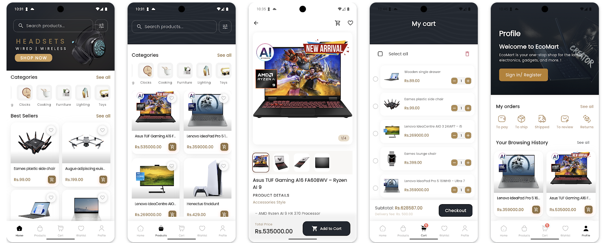

# Flutter Ecommerce App with WooCommerce Integration

[](https://flutter.dev/)
[](https://dart.dev/)
[](https://opensource.org/licenses/MIT)
[](http://makeapullrequest.com)
[](https://github.com/amlsampath/FlutterWooStore/graphs/contributors)
[](https://github.com/amlsampath/FlutterWooStore/issues)
[](https://github.com/amlsampath/FlutterWooStore/stargazers)



A modern, feature-rich Flutter ecommerce application built with clean architecture principles and integrated with WooCommerce backend. This app provides a complete mobile shopping experience with authentication, product browsing, cart management, checkout, and payment processing.

## 📱 About This Project

**FlutterWooStore** is a comprehensive ecommerce mobile application built with Flutter that seamlessly integrates with WooCommerce-powered online stores. This project demonstrates modern mobile app development practices while providing a complete shopping experience for customers.

### 🎯 Project Goals

- **Complete Ecommerce Solution**: Provide a full-featured mobile shopping experience
- **WooCommerce Integration**: Seamless connection with existing WooCommerce stores
- **Clean Architecture**: Maintainable and scalable codebase following best practices
- **Modern UI/UX**: Beautiful, intuitive interface with smooth animations
- **Performance Optimized**: Fast loading times and efficient resource usage
- **Cross-Platform**: Single codebase for both Android and iOS platforms

### 🛠️ Technical Highlights

- **Flutter 3.16+**: Latest Flutter framework with Dart 3.0+
- **Clean Architecture**: Separation of concerns with domain, data, and presentation layers
- **BLoC Pattern**: State management using flutter_bloc for predictable state changes
- **WooCommerce REST API**: Direct integration with WooCommerce backend
- **Local Storage**: Hive database for offline data persistence
- **Payment Integration**: PayHere payment gateway for secure transactions
- **Responsive Design**: Adaptive layouts for various screen sizes
- **Theme System**: Centralized theming with dark/light mode support

### 🏪 Key Features

- **Product Catalog**: Browse products with categories, search, and filters
- **Shopping Cart**: Add items, manage quantities, and view cart total
- **User Authentication**: Secure login/registration with JWT tokens
- **Order Management**: Complete order lifecycle from cart to delivery
- **Payment Processing**: Integrated payment gateway with PayHere
- **User Profiles**: Manage personal information and shipping addresses
- **Favorites/Wishlist**: Save and manage favorite products
- **Search & History**: Advanced search with browsing history
- **Offline Support**: Core functionality works without internet connection

### 🎨 Design Philosophy

This project emphasizes:
- **User-Centric Design**: Intuitive navigation and smooth user experience
- **Performance First**: Optimized for speed and efficiency
- **Accessibility**: Support for screen readers and assistive technologies
- **Modern Aesthetics**: Clean, professional design with attention to detail
- **Consistent Theming**: Unified design language throughout the app

### 🔧 Development Approach

- **Modular Architecture**: Feature-based organization for easy maintenance
- **Dependency Injection**: GetIt for service locator pattern
- **Error Handling**: Comprehensive error management and user feedback
- **Testing Strategy**: Unit, widget, and integration tests
- **Code Quality**: Strict linting rules and code formatting
- **Documentation**: Comprehensive inline documentation and guides

## 🌟 Features

### Core Features
- **User Authentication**: Login, registration, password reset
- **Product Catalog**: Browse products by categories, search, filters
- **Shopping Cart**: Add/remove items, quantity management
- **Wishlist**: Save favorite products
- **Checkout Process**: Multi-step checkout with address management
- **Payment Integration**: PayHere payment gateway integration
- **Order Management**: View order history and details
- **User Profile**: Manage personal information and addresses

## 🏗️ Architecture Overview

This project follows **Clean Architecture** principles with a clear separation of concerns:

```
lib/
├── core/                    # Shared utilities, theme, network, widgets
├── features/               # Feature-based modules
│   ├── auth/              # Authentication & user management
│   ├── products/          # Product catalog & details
│   ├── cart/              # Shopping cart functionality
│   ├── checkout/          # Order processing & payment
│   ├── favorites/         # Wishlist management
│   ├── search/            # Product search functionality
│   ├── categories/        # Product categorization
│   ├── account/           # User profile & orders
│   ├── home/              # Home screen & featured content
│   └── settings/          # App settings & preferences
└── main.dart              # App entry point
```

## 🚀 Quick Start

### Prerequisites

- Flutter SDK (>=3.0.0)
- Dart SDK (>=3.0.0)
- Android Studio / VS Code
- Git

### Installation

1. **Clone the Repository**:
   ```bash
   git clone https://github.com/amlsampath/FlutterWooStore.git
   cd FlutterWooStore
   ```

2. **Install Dependencies**:
   ```bash
   flutter pub get
   ```

3. **Environment Configuration**:
   
   Create a `.env` file in the root directory with **all required values**:
   ```env
   # API Configuration (REQUIRED)
   BASE_URL=https://your-woocommerce-site.com/
   CONSUMER_KEY=ck_your_consumer_key_here
   CONSUMER_SECRET=cs_your_consumer_secret_here
   
   # App Configuration (REQUIRED)
   APP_NAME=Ecommerce App
   APP_VERSION=1.0.0
   APP_ENVIRONMENT=development
   
   # Feature Flags (REQUIRED)
   ENABLE_ANALYTICS=true
   ENABLE_CRASH_REPORTING=true
   ENABLE_PUSH_NOTIFICATIONS=true
   ```

   **⚠️ Important**: All environment variables are required. The app will fail to start if any value is missing or empty.

4. **Generate Code** (for freezed models):
   ```bash
   flutter packages pub run build_runner build --delete-conflicting-outputs
   ```

5. **Run the App**:
   ```bash
   flutter run
   ```

## 🔧 WooCommerce Setup

### 1. WordPress & WooCommerce Installation

1. **Install WordPress** on your hosting provider
2. **Install WooCommerce Plugin**:
   - Go to WordPress Admin → Plugins → Add New
   - Search for "WooCommerce"
   - Install and activate the plugin
   - Follow the setup wizard

### 2. WooCommerce REST API Configuration

1. **Generate API Keys**:
   - Go to WooCommerce → Settings → Advanced → REST API
   - Click "Add Key"
   - Set permissions to "Read/Write"
   - Copy the Consumer Key and Consumer Secret

2. **Configure API Endpoints**:
   - Ensure REST API is enabled
   - Set up proper CORS headers if needed
   - Test API connectivity

### 3. Required WooCommerce Extensions

Install these WooCommerce extensions for full functionality:

- **JWT Authentication for WP REST API**: For secure user authentication
- **WooCommerce Subscriptions** (optional): For subscription products
- **WooCommerce Bookings** (optional): For bookable products

### 4. WordPress Configuration

1. **Permalinks**: Set to "Post name" for clean URLs
2. **CORS Headers**: Add to `.htaccess` or server config:
   ```apache
   Header always set Access-Control-Allow-Origin "*"
   Header always set Access-Control-Allow-Methods "GET, POST, PUT, DELETE, OPTIONS"
   Header always set Access-Control-Allow-Headers "Content-Type, Authorization"
   ```

## 🔐 Authentication Flow

The app uses a dual authentication system:

### 1. WooCommerce API Authentication
- **Consumer Key/Secret**: For server-to-server communication
- **Basic Auth**: Base64 encoded credentials in headers
- **Used for**: Product data, order creation, customer management

### 2. JWT Authentication
- **JWT Tokens**: For user-specific operations
- **Secure Storage**: Tokens stored in Flutter Secure Storage
- **Used for**: User profile, order history, personalized content

### Authentication Implementation

```dart
// WooCommerce API Auth
final credentials = '$consumerKey:$consumerSecret';
final base64Str = base64Encode(utf8.encode(credentials));
options.headers['Authorization'] = 'Basic $base64Str';

// JWT Auth for user operations
options.headers['Authorization'] = 'Bearer $jwtToken';
```

## 📊 State Management

The app uses **BLoC (Business Logic Component)** pattern for state management:

### Key BLoCs
- **AuthBloc**: User authentication and profile management
- **ProductBloc**: Product catalog and search
- **CartBloc**: Shopping cart operations
- **CheckoutBloc**: Order processing and payment
- **FavoriteBloc**: Wishlist management
- **SearchBloc**: Product search functionality

### Example BLoC Usage

```dart
BlocProvider(
  create: (context) => sl<ProductBloc>(),
  child: BlocBuilder<ProductBloc, ProductState>(
    builder: (context, state) {
      if (state is ProductLoading) {
        return CircularProgressIndicator();
      } else if (state is ProductLoaded) {
        return ProductGrid(products: state.products);
      }
      return Container();
    },
  ),
)
```

## 🗄️ Data Layer

### Local Storage (Hive)
- **Cart Items**: Persistent shopping cart
- **Favorites**: User's wishlist
- **User Data**: Profile information
- **Search History**: Recent search queries
- **Browsing History**: Viewed products

### Remote Data Sources
- **WooCommerce REST API**: Product catalog, orders, customers
- **JWT Authentication**: User authentication
- **PayHere API**: Payment processing

### Repository Pattern

```dart
abstract class ProductRepository {
  Future<Either<Failure, List<Product>>> getProducts();
  Future<Either<Failure, Product>> getProductById(int id);
}

class ProductRepositoryImpl implements ProductRepository {
  final ProductRemoteDataSource remoteDataSource;
  final ProductLocalDataSource localDataSource;
  
  // Implementation with caching and error handling
}
```

## 🎨 UI/UX Design

### Theme System
The app implements a centralized theme system with:

- **AppColors**: All color definitions
- **AppTextStyles**: Typography styles
- **AppDimensions**: Spacing and sizing
- **AppAssets**: Image and icon paths

### Key UI Components
- **ProductCard**: Reusable product display
- **CartButton**: Animated cart icon with badge
- **AppAppBar**: Consistent app bar design
- **BottomNavigation**: Main navigation
- **LoadingShimmer**: Skeleton loading states

### Responsive Design
- **Grid Layouts**: Adaptive product grids
- **Flexible Widgets**: Responsive to screen size
- **Touch Targets**: Minimum 44px touch areas
- **Accessibility**: Screen reader support

## 💳 Payment Integration

### PayHere Integration
The app integrates with PayHere payment gateway:

1. **Merchant Configuration**:
   ```dart
   PaymentRemoteDataSource(
     merchantId: 'your_merchant_id',
     merchantSecret: 'your_merchant_secret',
     isSandbox: true, // Set to false for production
   )
   ```

2. **Payment Flow**:
   - Create order in WooCommerce
   - Initialize payment with PayHere
   - Process payment response
   - Update order status

### Payment Security
- **HTTPS Only**: All payment communications
- **Token Validation**: Verify payment responses
- **Error Handling**: Graceful payment failures
- **Receipt Generation**: Payment confirmation

## 🚀 Deployment

### Android Build
```bash
# Generate signed APK
flutter build apk --release

# Generate App Bundle
flutter build appbundle --release
```

### iOS Build
```bash
# Build for iOS
flutter build ios --release

# Archive in Xcode
open ios/Runner.xcworkspace
```

### Environment Configuration
- **Development**: Local testing with sandbox APIs
- **Staging**: Pre-production testing
- **Production**: Live environment with production APIs

## 🧪 Testing

### Unit Tests
```bash
flutter test
```

### Widget Tests
```bash
flutter test test/widget_test.dart
```

### Integration Tests
```bash
flutter drive --target=test_driver/app.dart
```

### Manual Testing Checklist
Before submitting a pull request, please ensure:

- [ ] App builds successfully on both Android and iOS
- [ ] All existing functionality works as expected
- [ ] New features are tested on multiple devices
- [ ] UI looks correct in both light and dark themes
- [ ] No console errors or warnings
- [ ] Performance is acceptable

## 📈 Performance Optimization

### Image Optimization
- **Cached Network Images**: Efficient image loading
- **Lazy Loading**: Load images on demand
- **Compression**: Optimized image sizes

### State Management
- **Efficient BLoCs**: Minimal state updates
- **Memory Management**: Proper disposal of resources
- **Background Processing**: Non-blocking operations

### Network Optimization
- **Request Caching**: Reduce API calls
- **Pagination**: Load data in chunks
- **Error Handling**: Graceful network failures

## 🔧 Configuration

### API Endpoints
The app communicates with these WooCommerce endpoints:

- **Products**: `/wp-json/wc/v3/products`
- **Categories**: `/wp-json/wc/v3/products/categories`
- **Orders**: `/wp-json/wc/v3/orders`
- **Customers**: `/wp-json/wc/v3/customers`
- **Authentication**: `/wp-json/jwt-auth/v1/token`

### Environment Variables
All configuration is managed through environment variables for security and flexibility.

## 🤝 Contributing

We love your input! We want to make contributing to this project as easy and transparent as possible, whether it's:

- 🐛 Reporting a bug
- 💡 Discussing the current state of the code
- 📝 Submitting a fix
- 🚀 Proposing new features
- 📖 Becoming a maintainer

We use GitHub to host code, to track issues and feature requests, as well as accept pull requests.

We actively welcome your pull requests:

1. Fork the repo and create your branch from `main`.
2. If you've added code that should be tested, add tests.
3. If you've changed APIs, update the documentation.
4. Ensure the test suite passes.
5. Make sure your code lints.
6. Issue that pull request!

### Development Setup

See our [Contributing Guide](CONTRIBUTING.md) for detailed instructions on how to set up your development environment and contribute to the project.

### Quality Assurance

Before submitting your contribution, please ensure:

- [ ] Code follows the project's style guidelines
- [ ] All tests pass locally
- [ ] Code is properly documented
- [ ] No sensitive information is included
- [ ] Changes are backward compatible (if applicable)

## 📄 License

This project is licensed under the MIT License - see the [LICENSE](LICENSE) file for details.

## 🆘 Support

### Getting Help

- 📖 **Documentation**: Check the [README](README.md) and code comments
- 🐛 **Bug Reports**: Create an issue with the bug report template
- 💡 **Feature Requests**: Create an issue with the feature request template
- 💬 **Discussions**: Use GitHub Discussions for questions and general discussion
- 📧 **Email**: Contact us at [support@yourdomain.com](mailto:support@yourdomain.com)

### Community

- 🌟 **Star the repo**: Show your support
- 👀 **Watch the repo**: Get notified of updates
- 🔔 **Follow releases**: Stay updated with new features
- 💬 **Join discussions**: Share ideas and get help

## 🙏 Acknowledgments

- **Flutter Team**: For the amazing framework
- **WooCommerce**: For the robust ecommerce platform
- **Contributors**: Everyone who has contributed to this project
- **Open Source Community**: For inspiration and support

## 📊 Project Status

- **Version**: 1.0.2
- **Status**: Active Development
- **Last Updated**: January 2024
- **Maintainers**: [Aml Sampath](https://github.com/amlsampath)

## 🔄 Updates

Stay updated with the latest changes:
- Follow the repository
- Check the [releases page](https://github.com/amlsampath/FlutterWooStore/releases)
- Read the [changelog](CHANGELOG.md)

---

**Built with ❤️ using Flutter and WooCommerce**

<div align="center">
  <sub>Built with ❤️ by the Flutter Ecommerce App team</sub>
</div>
